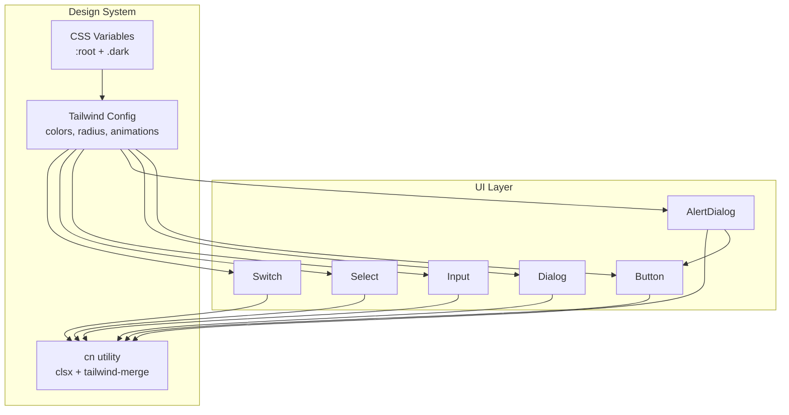
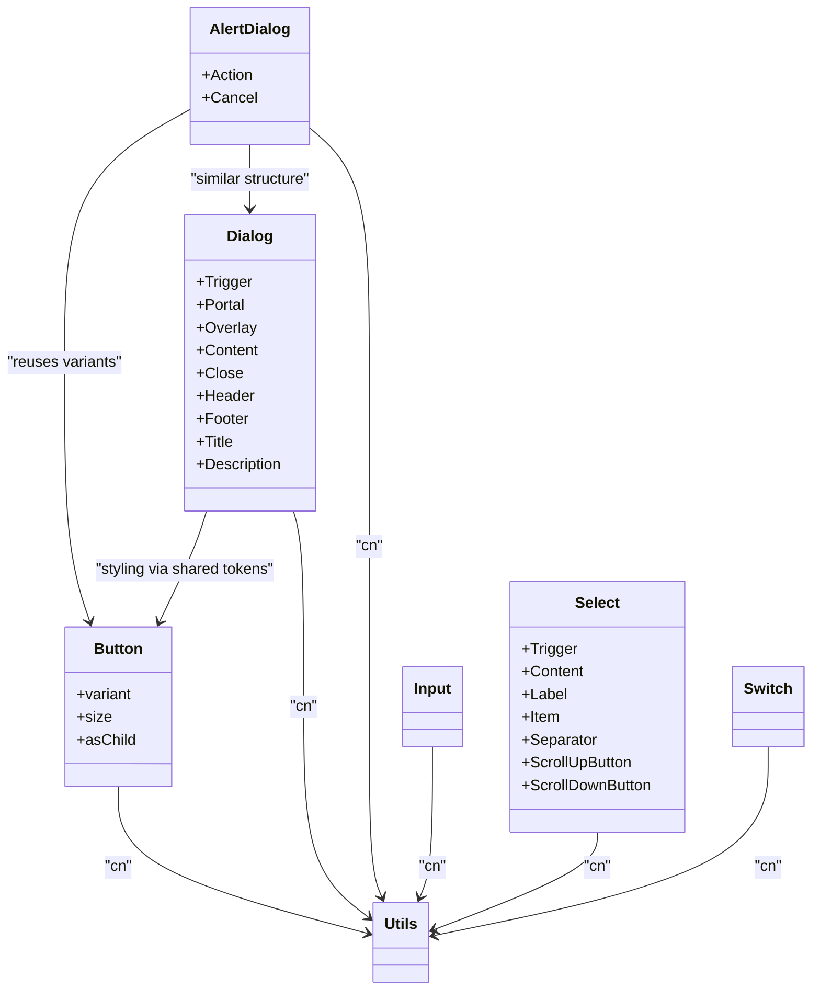
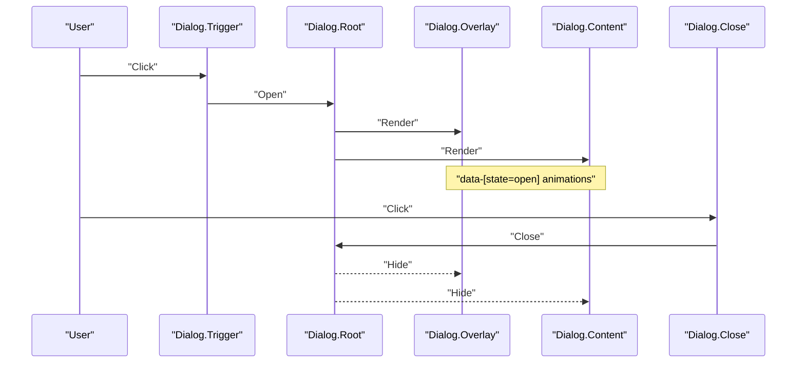
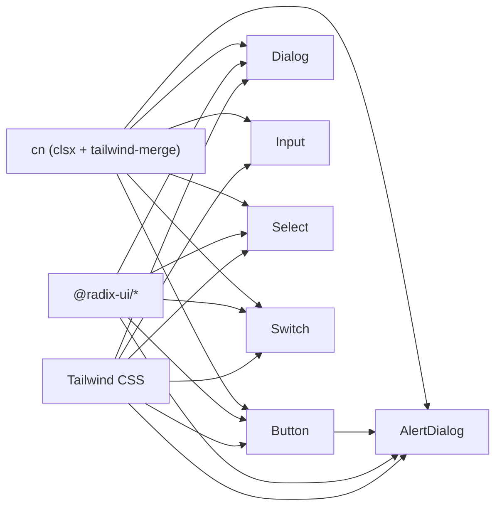

# UI Components

<cite>
**Referenced Files in This Document**
- [button.tsx](file://src/components/ui/button.tsx)
- [dialog.tsx](file://src/components/ui/dialog.tsx)
- [alert-dialog.tsx](file://src/components/ui/alert-dialog.tsx)
- [input.tsx](file://src/components/ui/input.tsx)
- [select.tsx](file://src/components/ui/select.tsx)
- [switch.tsx](file://src/components/ui/switch.tsx)
- [utils.ts](file://src/lib/utils.ts)
- [tailwind.config.ts](file://tailwind.config.ts)
- [index.css](file://src/index.css)
- [components.json](file://components.json)
</cite>

## Table of Contents
1. Introduction
2. Project Structure
3. Core Components
4. Architecture Overview
5. Detailed Component Analysis
6. Dependency Analysis
7. Performance Considerations
8. Troubleshooting Guide
9. Conclusion

## Introduction
This document describes Smart Scan Pro’s UI component system built on Radix UI primitives and styled with Tailwind CSS. It covers the base components (buttons, dialogs, alerts, inputs, select, switch), the design system implementation using Tailwind theme configuration and CSS variables, composition patterns, responsive and accessible behavior, cross-browser considerations, customization options, theming support, states, usage examples, and performance best practices.

## Project Structure
The UI layer is organized under src/components/ui with each primitive wrapped into a composable component. Styling is centralized via Tailwind configuration and CSS variables for theming. Utilities like cn enable safe class merging.

**Diagram sources**
- [button.tsx](file://src/components/ui/button.tsx)
- [dialog.tsx](file://src/components/ui/dialog.tsx)
- [alert-dialog.tsx](file://src/components/ui/alert-dialog.tsx)
- [input.tsx](file://src/components/ui/input.tsx)
- [select.tsx](file://src/components/ui/select.tsx)
- [switch.tsx](file://src/components/ui/switch.tsx)
- [utils.ts](file://src/lib/utils.ts)
- [tailwind.config.ts](file://tailwind.config.ts)
- [index.css](file://src/index.css)

**Section sources**
- [components.json](file://components.json)
- [tailwind.config.ts](file://tailwind.config.ts)
- [index.css](file://src/index.css)
- [utils.ts](file://src/lib/utils.ts)

## Core Components
- Button: A variant-driven button supporting multiple styles and sizes, with asChild composition to render as any element.
- Dialog: A full-featured modal dialog with overlay, portal, header/footer, title, description, and close control.
- AlertDialog: An alert-style dialog that reuses Button variants for actions and cancel buttons.
- Input: A text input with consistent focus ring, disabled state, and placeholder styling.
- Select: A complete select dropdown with trigger, content viewport, labels, items, separators, and scroll buttons.
- Switch: A toggle switch with checked/unchecked states, focus ring, and disabled handling.

All components use the cn utility for robust class merging and rely on Tailwind classes mapped to CSS variables for theming.

**Section sources**
- [button.tsx](file://src/components/ui/button.tsx)
- [dialog.tsx](file://src/components/ui/dialog.tsx)
- [alert-dialog.tsx](file://src/components/ui/alert-dialog.tsx)
- [input.tsx](file://src/components/ui/input.tsx)
- [select.tsx](file://src/components/ui/select.tsx)
- [switch.tsx](file://src/components/ui/switch.tsx)
- [utils.ts](file://src/lib/utils.ts)

## Architecture Overview
The UI architecture follows a layered approach:
- Primitives: Radix UI provides unstyled, accessible building blocks.
- Composition: Each UI component wraps primitives and applies Tailwind classes.
- Theming: Tailwind maps semantic color tokens to CSS variables defined in index.css.
- Utility: The cn helper merges class names deterministically.

**Diagram sources**
- [button.tsx](file://src/components/ui/button.tsx)
- [dialog.tsx](file://src/components/ui/dialog.tsx)
- [alert-dialog.tsx](file://src/components/ui/alert-dialog.tsx)
- [input.tsx](file://src/components/ui/input.tsx)
- [select.tsx](file://src/components/ui/select.tsx)
- [switch.tsx](file://src/components/ui/switch.tsx)
- [utils.ts](file://src/lib/utils.ts)

## Detailed Component Analysis

### Button
- Purpose: Primary interactive element with consistent visual language.
- Props:
  - variant: default, destructive, outline, secondary, ghost, link
  - size: default, sm, lg, icon
  - asChild: boolean to render as a child component via Slot
  - className: additional Tailwind classes merged via cn
- States: hover, focus-visible, disabled
- Accessibility: Focus ring, keyboard activation, pointer-events handling for icons
- Usage example:
  - Default primary button
  - Destructive action
  - Outline or ghost for subtle actions
  - Icon-only button
  - Render as Link using asChild

**Section sources**
- [button.tsx](file://src/components/ui/button.tsx)

### Dialog
- Purpose: Modal overlay for focused tasks or confirmations.
- Sub-components:
  - Trigger: opens the dialog
  - Portal: renders outside DOM hierarchy
  - Overlay: backdrop with fade transitions
  - Content: centered card with slide/fade animations
  - Close: dismiss button with screen reader label
  - Header/Footer: layout containers
  - Title/Description: semantic headings and body text
- States: open/closed with data-state animations
- Accessibility: focus trapping, escape to close, aria attributes from Radix
- Usage example:
  - Open with a trigger
  - Add header/title/description
  - Footer with action buttons

**Diagram sources**
- [dialog.tsx](file://src/components/ui/dialog.tsx)

**Section sources**
- [dialog.tsx](file://src/components/ui/dialog.tsx)

### AlertDialog
- Purpose: Confirmation dialog pattern with action and cancel buttons.
- Reuses Button variants for Action and Cancel.
- Structure mirrors Dialog with its own overlay/content and header/footer.
- Usage example:
  - Show destructive confirmation
  - Provide primary action and outline cancel

**Section sources**
- [alert-dialog.tsx](file://src/components/ui/alert-dialog.tsx)
- [button.tsx](file://src/components/ui/button.tsx)

### Input
- Purpose: Standard text input with consistent border, padding, focus ring, and disabled state.
- Props:
  - type: input type
  - className: additional classes
  - All standard HTML input props forwarded
- States: focus-visible, disabled
- Usage example:
  - Basic text field
  - Disabled input
  - With placeholder and label (label typically provided by form context)

**Section sources**
- [input.tsx](file://src/components/ui/input.tsx)

### Select
- Purpose: Accessible dropdown selection with grouped items and scrolling.
- Sub-components:
  - Trigger: shows selected value and chevron
  - Content: positioned list with viewport sizing
  - Label: group heading
  - Item: selectable option with indicator
  - Separator: divider
  - ScrollUp/Down: navigation helpers
- States: open/closed, disabled, focus, selected
- Usage example:
  - Single-select with label and items
  - Grouped options with separator

**Section sources**
- [select.tsx](file://src/components/ui/select.tsx)

### Switch
- Purpose: Toggle control for binary settings.
- States: checked/unchecked, focus-visible, disabled
- Usage example:
  - Toggle feature flag
  - Settings preference

**Section sources**
- [switch.tsx](file://src/components/ui/switch.tsx)

## Dependency Analysis
- Internal dependencies:
  - All UI components depend on the cn utility for deterministic class merging.
  - AlertDialog depends on Button variants for consistent action styling.
- External dependencies:
  - Radix UI primitives provide accessibility and interaction semantics.
  - Tailwind CSS provides utility-first styling.
  - Lucide React icons are used within some components (e.g., Dialog close).

**Diagram sources**
- [button.tsx](file://src/components/ui/button.tsx)
- [dialog.tsx](file://src/components/ui/dialog.tsx)
- [alert-dialog.tsx](file://src/components/ui/alert-dialog.tsx)
- [input.tsx](file://src/components/ui/input.tsx)
- [select.tsx](file://src/components/ui/select.tsx)
- [switch.tsx](file://src/components/ui/switch.tsx)
- [utils.ts](file://src/lib/utils.ts)
- [tailwind.config.ts](file://tailwind.config.ts)

**Section sources**
- [utils.ts](file://src/lib/utils.ts)
- [tailwind.config.ts](file://tailwind.config.ts)

## Performance Considerations
- Prefer asChild on Button when composing with existing interactive elements to avoid extra wrapper nodes.
- Use conditional rendering sparingly; keep Dialog/AlertDialog closed until needed to reduce initial render cost.
- Avoid excessive className overrides; leverage variant and size props first.
- Keep large lists inside Select lightweight; virtualize if necessary at the application level.
- Ensure animations are GPU-friendly; the current keyframes and transforms are already efficient.
- Minimize re-renders by memoizing expensive children passed into Dialog/AlertDialog content.

[No sources needed since this section provides general guidance]

## Troubleshooting Guide
- Classes not applying:
  - Verify all custom classes are merged through cn to prevent conflicts.
- Focus ring missing:
  - Ensure focus-visible styles are not overridden; check for conflicting outline rules.
- Dark mode not switching:
  - Confirm the root element has the dark class toggled and CSS variables are present.
- Dialog not closing:
  - Check that Escape key is not intercepted elsewhere and that no sibling overlays block events.
- Select positioning issues:
  - Ensure the parent container does not clip overflow; adjust position prop if needed.

**Section sources**
- [dialog.tsx](file://src/components/ui/dialog.tsx)
- [select.tsx](file://src/components/ui/select.tsx)
- [index.css](file://src/index.css)

## Conclusion
Smart Scan Pro’s UI system combines Radix UI primitives with a cohesive Tailwind-based design system. Semantic tokens via CSS variables enable consistent theming across light and dark modes. The components follow clear composition patterns, maintain strong accessibility, and offer flexible customization through variants, sizes, and className overrides. Following the guidelines here will help you build consistent, performant, and accessible interfaces.